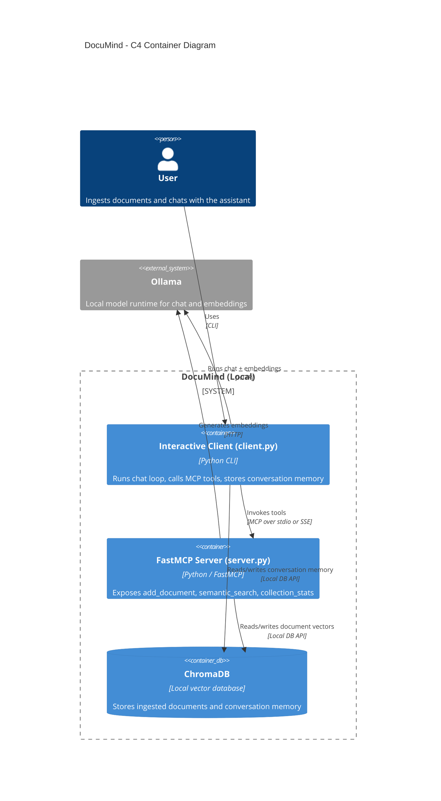

# DocuMind

Fully local RAG agent built with FastMCP + ChromaDB + Ollama models (`phi4-mini:3.8b-q4_K_M` and `embeddinggemma:300m-qat-q8_0`), managed with UV and linted/formatted with Ruff.

## Privacy and locality

All components run on your machine:
- LLM inference via local Ollama
- Embedding generation via local Ollama
- Vector storage/query via local ChromaDB

No cloud APIs are required.

## Architecture (C4, Mermaid)



## Prerequisites

- Python 3.13+
- [Ollama](https://ollama.com/) installed and running
- [UV](https://docs.astral.sh/uv/) installed

Install/pull models:

```bash
ollama pull phi4-mini:3.8b-q4_K_M
ollama pull embeddinggemma:300m-qat-q8_0
ollama list
```

## Project layout

```text
<project-root>/
├── pyproject.toml
├── uv.lock
├── .python-version
├── config.py
├── server.py
├── client.py
├── ingest.py
├── scripts/
├── data/
└── chroma_db/   # runtime-created, ignored by git
```

## Setup

```bash
cd <project-root>
python3 -m uv sync
```

## Ingest documents

v1 ingestion supports text/markdown files only (`.txt`, `.md`, `.markdown`).

```bash
uv run python ingest.py data/my_notes.txt
uv run python ingest.py data/notes.txt data/report.md
```

## Run the server (stdio + SSE)

Start Ollama if needed:

```bash
ollama serve
```

Run FastMCP server over stdio (default):

```bash
cd <project-root>
uv run python server.py --transport stdio
```

Enable verbose MCP context logs on the server:

```bash
cd <project-root>
uv run python server.py --transport stdio --log-level DEBUG --to-client-debug
```

Run FastMCP server over SSE:

```bash
cd <project-root>
uv run python server.py --transport sse --host 127.0.0.1 --port 8000
```

## Run the interactive client

Client persists conversation history in Chroma (`conversation_memory` collection) and supports stdio and SSE transports.
Responses are enforced in strict closed-domain mode:
- The assistant answers only from retrieved document context.
- If context is insufficient, it returns exactly: `I cannot answer this based on the provided documents.`
- Non-refusal answers must include sentence-level citations in the format `[Source: <source>]`.

Launch interactive client with default session id (stdio):

```bash
cd <project-root>
uv run python client.py
```

Launch with a custom persisted session:

```bash
cd <project-root>
uv run python client.py --session-id my-session
```

Override the server launch command used by the client (stdio mode):

```bash
cd <project-root>
uv run python client.py --transport stdio --server-command "uv run python server.py --transport stdio"
```

Connect client to an already running SSE server:

```bash
cd <project-root>
uv run python client.py --transport sse --sse-url "http://127.0.0.1:8000/sse"
```

Client log forwarding is always enabled; `--log-level` only changes verbosity:

```bash
cd <project-root>
uv run python client.py --log-level INFO
uv run python client.py --log-level DEBUG
```

## FastMCP tools (MVP)

- `add_document(text, doc_id=None, source="")`
- `semantic_search(query, n_results=5, source_filter="")`
- `collection_stats()`

## Testing (scripts + Ruff only)

Run script-based checks:

```bash
cd <project-root>
./scripts/ruff_check.sh
./scripts/smoke_ingest.sh
```

Direct Ruff commands:

```bash
cd <project-root>
python3 -m uv run ruff format .
python3 -m uv run ruff format --check . && python3 -m uv run ruff check .
```

## Operations checks

Verify collection count:

```bash
cd <project-root>
uv run python -c "import chromadb; c=chromadb.PersistentClient('./chroma_db'); print(c.get_or_create_collection('documents').count())"
```

## Troubleshooting

- `Connection refused` on `localhost:11434`
  - Ensure `ollama serve` is running.
- Missing model errors
  - Re-run `ollama pull phi4-mini:3.8b-q4_K_M` and `ollama pull embeddinggemma:300m-qat-q8_0`.
- Empty search results
  - Check ingestion completed and collection count is non-zero.
- ChromaDB embedding dimension mismatch
  - Keep one embedding model per collection; clear `chroma_db/` and re-ingest if model changes.
